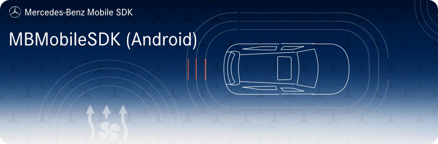

<!-- SPDX-License-Identifier: MIT -->

## Getting Started
We highly recommend to have a look into the [Getting Started Guide](docs/getting_started.md) to get an idea on how to use the framework.

## Contributing

We welcome any contributions.
If you want to contribute to this project, please read the [contributing guide](CONTRIBUTING.md).

## Code of Conduct

Please read our [Code of Conduct](https://github.com/Daimler/daimler-foss/blob/master/CODE_OF_CONDUCT.md) as it is our base for interaction.

## License

This project is licensed under the [MIT LICENSE](LICENSE).

## Provider Information

Please visit <https://mbition.io/en/home/index.html> for information on the provider.

Notice: Before you use the program in productive use, please take all
necessary precautions, e.g. testing and verifying the program with
regard to your specific use. The program was tested solely for our own
use cases, which might differ from yours.
